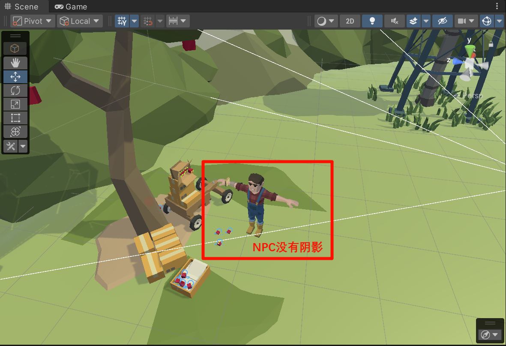
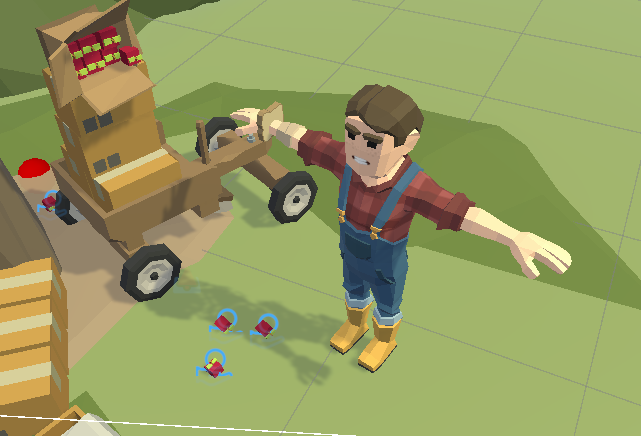

> Unity中部分模型没有显示阴影，我定义了NPC之后没有显示NPC的阴影。

<!-- truncate -->
:::warning 问题如下
游戏中的场景NPC没有阴影，并且光照也不正常，但是其他物体都有，Player也有，然后发现唯一的区别是Layer不同。
:::

  

:::tip
找到场景中的灯光——在Inspector面板——Rendering——Culling Mask（剔除遮罩）——勾选上你的NPC
:::

  

修改后：

  

