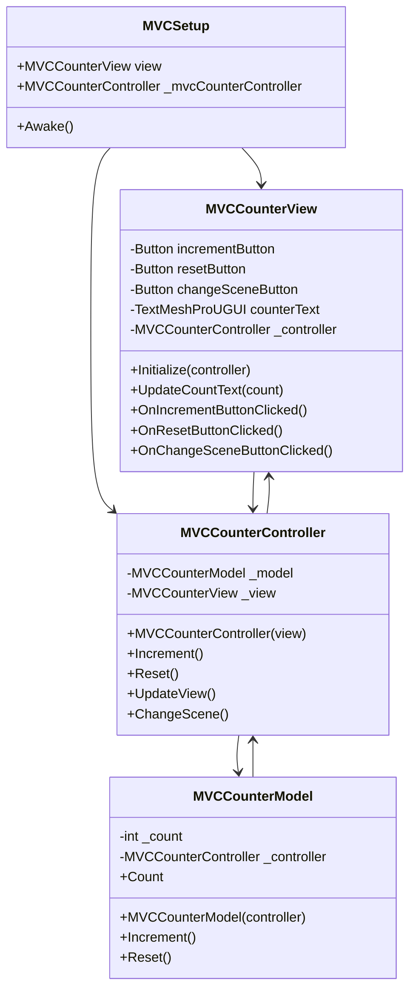
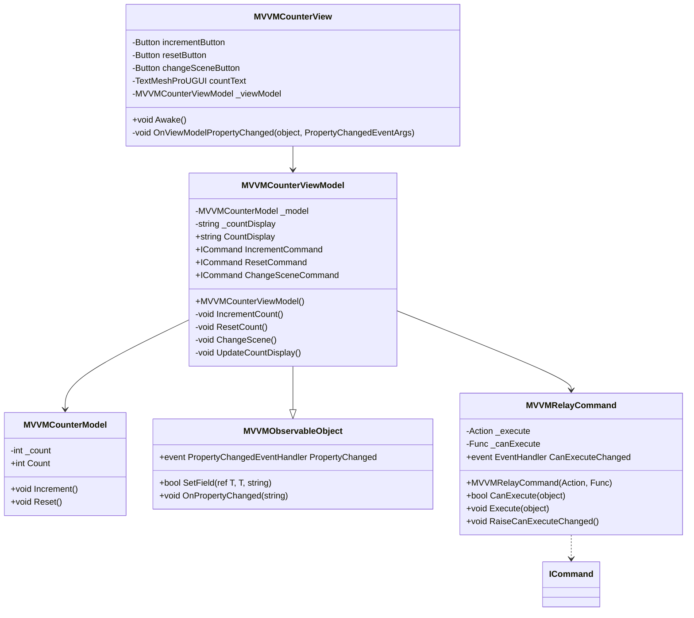

# MVC 与 MVVM 的区别，以及在 Unity 项目中的实践

## 区别 & 概念回顾
### 区别
说实话，思路上没啥区别。代码上，MVC需要手动触发，而 MVVM 通过事件监听，把函数触发写在了 ViewModel 中
### MVC
什么是MVC？Model、View、Controller。
一图胜千言：（如果图挂了请访问知乎原贴：[什么是MVVM框架？](https://zhuanlan.zhihu.com/p/59467370)）


> 附言，我今天看了很多帖子，不同的帖子对 MVC 的定义都不太统一，上图据说是 iOS 的开发框架的定义。

比如下面我做的 Unity 计数器例子，用户点击按钮，这时候 View 调用 Controller 的方法，更新 Model，在 Model 的更新函数中，又会调用 Controller 的方法来更新 View，这就形成了上图的关系。
### MVVM
什么是 MVVM？Model、View、ViewModel。


听起来是不是和 MVC 一样？确实，MVVM 就是改进版的 MVC，ViewModel “算是” 充当了 Controller 的位置，但又不太一样：

ViewModel 和 View 双向绑定，如胶似漆，还是刚才那个计数器的例子。当用户点击按钮，View 的按钮直接监听绑定 ViewModel 的具体方法，比如 Increment() 增加计数，而 ViewModel 则在函数中对 Model 更新数值然后读取 Model 的数值并应用在自己的属性中，当自己数值更改，通知订阅了此事件的函数，也就是 View 自己更新页面。

这样就完成了 View 和 Model 的解耦， Model 和 View 都减少了调用 Controller/VM 这种中间层的代码来直接操控对方（Model/View），从而解耦。
## Unity 实践
### 演示 Demo
用两种框架做了一个计数器，点击按钮数字+1，可以切换场景（MVC/MVVM），但表现层是一模一样的....
使用的 Unity WebGL 直接发布，网址如下：
https://play.unity.com/en/games/76ee5d18-3e00-429e-9a21-05fbcf604663/webgl-builds
### 代码分析：MVC
**概述：**
主要设计了三个脚本：
- MVCCounterController.cs
- MVCCounterModel.cs
- MVCCounterView.cs
以及一个设置脚本：
- MVCSetup.cs，用来引用 View 并初始化 Controller

应用到场景中，需要给某个物体挂载 MVCSetup.cs 和 MVCCounterView.cs，然后把按钮、Text那些引用上去。

上述脚本的流程关系如下：MVCSetup 只负责 new 一个 Controller 出来，并把引用的 View 传给Controller 的构造函数，Controller 负责创建 Model，并把自己传递给 Model 的构造函数，同时有一些函数用来调用 View 和 Model 相应方法，比如 Increment、Reset、UpdateView、ChangeScene，Model 负责自己的数据管理，并且在数据操作完成后，调用 Controller 的方法来更新 View。

**UML 类图如下：**


### 代码分析：MVVM
**概述：**
主要设计了三个脚本：
- MVVMCounterModel.cs
- MVVMCounterView.cs
- MVVMCounterViewModel.cs
以及两个辅助事件监听的脚本：
- MVVMObservableObject.cs，响应事件监听，继承自 INotifyPropertyChanged
- MVVMRelayCommand.cs，在 ViewModel 中绑定 UI 操作，继承自 ICommand

应用到场景中，需要给某个物体挂载 MVVMCounterView.cs 并把 UI 元素引用上去。

上述脚本的流程关系如下：View 负责引用页面元素，并给页面按钮添加事件监听（AddListener），有一个响应 ViewModel 属性改变的回调函数用来更新数字，ViewModel 中会声明 View 的各种按钮的具体方法（命令），在这些命令中对 Model 进行操控，操控后在 ViewModel 中更新自己的属性。而由于 ViewModel 继承了 MVVMObservableObject，MVVMObservableObject 继承了 INotifyPropertyChanged，在 SetField 过的属性的值被更改的时候，会触发事件，从而通知到 View 中的更新函数。

**UML 类图如下：**

### 差异比较
如文首所述，主要差异在于 MVVM 中的 ViewModel 与 View 通过事件绑定了，所以解耦了 View 和 Model，便于项目的维护。

比如新增了一个需求：计数器要增加一个按钮，点击按钮后，计数器 +100。

MVC架构下要这样改：
- View 中注册按钮，给按钮新增一个函数，这个函数来调用 Controller 的函数 A
- Controller 中新增两个函数 A 和函数 B，A 函数用来调用 Model 中的 +100 方法，B 函数用来更新 View 的显示（可能不需要，之前已经实现）
- Model 中新增一个函数，这个函数用来 +100，+100之后，调用 Controller 的函数 B 来更新 View 的显示

MVVM 架构下这样改：
- View 中注册按钮，给按钮添加一个监听，这个监听指向 ViewModel 的相关方法。相比于 MVC 少声明了一个函数。
- ViewModel 新增一个方法，用来操作 Model，根据需要等待 Model 返回，Model 返回后，更新自己的值（比如Count），View 会响应更改事件刷新页面。
- Model 中新增一个函数，用来+100，相比于 MVC，Model 完全不用管 View。

这只是个小例子，在大项目中，MVVM 相比于 MVC 还是剩了不少代码，并且代码之间的交互更简洁优雅。
## 具体代码实现
### MVC
MVCSetup.cs
```csharp
using System;  
using UnityEngine;  
  
namespace Test.MVC  
{  
    public class MVCSetup : MonoBehaviour  
    {  
        [SerializeField] private MVCCounterView view;  
        private MVCCounterController _mvcCounterController;  
  
        private void Awake()  
        {            
	        _mvcCounterController = new MVCCounterController(view); // Simplified constructor call  
        }  
    }
}
```
MVCCounterModel.cs
```csharp
namespace Test.MVC
{
    // Model - 负责数据和业务逻辑
    public class MVCCounterModel
    {
        private int _count;
        private MVCCounterController _controller;

        public MVCCounterModel(MVCCounterController controller)
        {
            _controller = controller;
        }

        public int Count
        {
            get => _count;
            private set => _count = value;
        }
        
        public void Increment()
        {
            _count++;
            _controller.UpdateView();
        }

        public void Reset()
        {
            _count = 0;
            _controller.UpdateView();
        }
    }
}
```

MVCCounterController.cs
```csharp
using Test.MVC;  
using UnityEngine.PlayerLoop;  
using UnityEngine.SceneManagement;  
  
public class MVCCounterController  
{  
    private readonly MVCCounterModel _model;  
    private readonly MVCCounterView _view;  
    public MVCCounterController(MVCCounterView view)  
    {        _view = view;  
        _model = new MVCCounterModel(this); // Create the model and pass the controller  
  
        _view.Initialize(this);  
        UpdateView();  
    }    public void Increment() => _model.Increment();  
    public void Reset() => _model.Reset();  
    public void UpdateView() => _view.UpdateCountText(_model.Count);  
    public void ChangeScene() => SceneManager.LoadScene("MVVMSampleScene", LoadSceneMode.Single);  
}
```

MVCCounterView.cs
```csharp
using UnityEngine;  
using UnityEngine.UI;  
using TMPro;  
  
namespace Test.MVC  
{  
    public class MVCCounterView : MonoBehaviour  
    {  
        [SerializeField] private Button incrementButton;  
        [SerializeField] private Button resetButton;  
        [SerializeField] private Button changeSceneButton;  
        [SerializeField] private TextMeshProUGUI counterText;  
        private MVCCounterController _controller;  
  
        public void Initialize(MVCCounterController controller)  
        {            _controller = controller;  
            incrementButton.onClick.AddListener(OnIncrementButtonClicked);  
            resetButton.onClick.AddListener(OnResetButtonClicked);  
            changeSceneButton.onClick.AddListener(OnChangeSceneButtonClicked);  
        }        // 更新显示的计数  
        public void UpdateCountText(int count)  
        {            counterText.text = $"{count}";  
        }  
        private void OnIncrementButtonClicked() => _controller.Increment();  
  
        private void OnResetButtonClicked() => _controller.Reset();  
        private void OnChangeSceneButtonClicked() => _controller.ChangeScene();  
    }
}
```
### MVVM

MVVMCounterView.cs
```csharp
using UnityEngine;  
using UnityEngine.UI;  
using TMPro;  
namespace Test.MVVM  
{  
    public class MVVMCounterView : MonoBehaviour  
    {  
        [SerializeField] private Button incrementButton;  
        [SerializeField] private Button resetButton;  
        [SerializeField] private Button changeSceneButton;  
        [SerializeField] private TextMeshProUGUI countText;  
  
        private MVVMCounterViewModel _viewModel;  
  
        private void Awake()  
        {            // 创建视图模型  
            _viewModel = new MVVMCounterViewModel();  
        // 绑定视图模型属性到UI元素  
            countText.text = _viewModel.CountDisplay;  
            _viewModel.PropertyChanged += OnViewModelPropertyChanged;  
        // 绑定命令到按钮  
            incrementButton.onClick.AddListener(() => _viewModel.IncrementCommand.Execute(null));  
            resetButton.onClick.AddListener(() => _viewModel.ResetCommand.Execute(null));  
            changeSceneButton.onClick.AddListener(()=> _viewModel.ChangeSceneCommand.Execute(null));  
        }  
        // 当视图模型属性变化时更新UI  
        private void OnViewModelPropertyChanged(object sender, System.ComponentModel.PropertyChangedEventArgs e)  
        {            if (e.PropertyName == nameof(_viewModel.CountDisplay))  
            {                countText.text = _viewModel.CountDisplay;  
            }        }    }}
```

MVVMCounterViewModel.cs
```csharp
namespace Test.MVVM  
{  
    using System.Windows.Input;  
    using UnityEngine.SceneManagement;  
    // 视图模型 - 连接模型和视图，处理视图逻辑  
    public class MVVMCounterViewModel : MVVMObservableObject  
    {  
        private readonly MVVMCounterModel _model;  
    // 绑定到视图的属性  
        private string _countDisplay;  
        public string CountDisplay   
{   
get => _countDisplay;   
private set => SetField(ref _countDisplay, value);   
        }  
  
        // 绑定到按钮的命令  
        public ICommand IncrementCommand { get; }  
        public ICommand ResetCommand { get; }  
        public ICommand ChangeSceneCommand { get; }  
  
        public MVVMCounterViewModel()  
        {            _model = new MVVMCounterModel();  
        // 初始化命令  
            IncrementCommand = new MVVMRelayCommand(IncrementCount);  
            ResetCommand = new MVVMRelayCommand(ResetCount);  
            ChangeSceneCommand = new MVVMRelayCommand(ChangeScene);  
        // 初始更新显示  
            UpdateCountDisplay();  
        }  
        private void IncrementCount()  
        {            _model.Increment();  
            UpdateCountDisplay();  
        }  
        private void ResetCount()  
        {            _model.Reset();  
            UpdateCountDisplay();  
        }  
        private void ChangeScene() => SceneManager.LoadScene("MVCSampleScene", LoadSceneMode.Single);  
  
        private void UpdateCountDisplay()  
        {            CountDisplay = $"{_model.Count}";  
        }    }  
}
```

MVVMCounterModel.cs
```csharp
namespace Test.MVVM  
{  
    public class MVVMCounterModel  
    {  
        private int _count;  
  
        public int Count   
{   
get => _count;   
private set   
            {  
                _count = value;  
            }   
}  
  
        public void Increment()  
        {            _count++;  
        }  
        public void Reset()  
        {            _count = 0;  
        }    }}
```

MVVMObservableObject.cs
```csharp
using System.Collections.Generic;  
  
namespace Test.MVVM  
{  
// 可观察对象基类，实现属性变化通知  
    using System.ComponentModel;  
    using System.Runtime.CompilerServices;  
  
    public class MVVMObservableObject : INotifyPropertyChanged  
    {  
        public event PropertyChangedEventHandler PropertyChanged;  
  
        protected virtual void OnPropertyChanged([CallerMemberName] string propertyName = null)  
        {            PropertyChanged?.Invoke(this, new PropertyChangedEventArgs(propertyName));  
        }  
        protected bool SetField<T>(ref T field, T value, [CallerMemberName] string propertyName = null)  
        {            if (EqualityComparer<T>.Default.Equals(field, value)) return false;  
            field = value;            OnPropertyChanged(propertyName);  
            return true;  
        }    }}
```

MVVMRelayCommand.cs
```csharp
namespace Test.MVVM  
{  
    // 命令实现类，用于绑定UI操作  
    using System;  
    using System.Windows.Input;  
    public class MVVMRelayCommand : ICommand  
    {  
        private readonly Action _execute;  
        private readonly Func<bool> _canExecute;  
  
        public event EventHandler CanExecuteChanged;  
  
        public MVVMRelayCommand(Action execute, Func<bool> canExecute = null)  
        {            _execute = execute ?? throw new ArgumentNullException(nameof(execute));  
            _canExecute = canExecute;  
        }  
        public bool CanExecute(object parameter)  
        {            return _canExecute == null || _canExecute();  
        }  
        public void Execute(object parameter)  
        {            _execute();  
        }  
        public void RaiseCanExecuteChanged()  
        {            CanExecuteChanged?.Invoke(this, EventArgs.Empty);  
        }    }}
```

---

> 标题：MVC 与 MVVM 的区别，以及在 Unity 项目中的实践  
> 作者：[LeonYew](mailto:learngenius@outlook.com)  
> 日期：2025-09-29
