# 📃 Docusaurus 快速回顾
## 本地调试
```bash
cd my-website
npm run start
```
这时候，大概率会在 http://localhost:3000/ 这个地址预览
## 打包发布
> 貌似不用本地打包，直接push到GitHub上，通过Actions自动打包发布到GitHub Pages上了

打包构建
```bash
npm run build
```
本地调试构建版本：
```bash
npm run serve
```
## Docuruaus Markdown 额外语法
### 文本信息
像这篇快速回顾一样，直接在侧边栏的文章，可以直接讲md文件放在docs文件夹下，并通过文档首部的`sidebar_position`来设置它在侧边栏的位置。

具体的设置项，参考这个[插件文档](https://docusaurus.io/docs/api/plugins/@docusaurus/plugin-content-docs#markdown-front-matter)。

或者参考下方[ `_category_.json` 设置](#categoryjson-侧边栏索引项设置)。

```markdown
---
id: my-doc-id
title: My document title
description: My document description
slug: /my-custom-url
# 文章标签
tags: [tutorial,tag2,tag3]
# 侧边栏索引位置
sidebar_position: 1
---
```

### 特殊警告样式
> note, tip, info, warning, danger
```
:::note
一些带有 **加粗**、_斜体_ 和 `代码` 等 Markdown 语法的 **内容**。查看 [这个 `API`](#)。
:::

:::tip
一些带有 **加粗**、_斜体_ 和 `代码` 等 Markdown 语法的 **内容**。查看 [这个 `API`](#)。
:::

:::info
一些带有 **加粗**、_斜体_ 和 `代码` 等 Markdown 语法的 **内容**。查看 [这个 `API`](#)。
:::

:::warning
一些带有 **加粗**、_斜体_ 和 `代码` 等 Markdown 语法的 **内容**。查看 [这个 `API`](#)。
:::

:::danger
一些带有 **加粗**、_斜体_ 和 `代码` 等 Markdown 语法的 **内容**。查看 [这个 `API`](#)。
:::
```
:::note
一些带有 **加粗**、_斜体_ 和 `代码` 等 Markdown 语法的 **内容**。查看 [这个 `API`](#)。
:::

:::tip
一些带有 **加粗**、_斜体_ 和 `代码` 等 Markdown 语法的 **内容**。查看 [这个 `API`](#)。
:::

:::info
一些带有 **加粗**、_斜体_ 和 `代码` 等 Markdown 语法的 **内容**。查看 [这个 `API`](#)。
:::

:::warning
一些带有 **加粗**、_斜体_ 和 `代码` 等 Markdown 语法的 **内容**。查看 [这个 `API`](#)。
:::

:::danger
一些带有 **加粗**、_斜体_ 和 `代码` 等 Markdown 语法的 **内容**。查看 [这个 `API`](#)。
:::

## _category_.json 侧边栏索引项设置
`_category_.json` 文件可以设置文件夹在侧边栏的名称和排序

```json
{
  "position": 2.5,
  "label": "Tutorial", // 文件夹的名称（网址栏显示的名称）
  "collapsible": true, // 是否可折叠，不可折叠的话，会显示所有的子文件
  "collapsed": false,
  "className": "red", // 自定义类名，用于设置样式
  "link": {
    "type": "generated-index",
    "title": "Tutorial overview" // 文件夹的标题
  },
  "customProps": {
    "description": "This description can be used in the swizzled DocCard" // 自定义属性，用于设置样式
  }
}
```

## Mermaid Diagram 语法

### 可见性
- `+` 表示公共（public）
- `-` 表示私有（private）
- `#` 表示受保护（protected）
- `~` 表示包级（package）

### 关系
| **关系类型**              | **表示方式**            | **描述**                                               | **关键特性**                                                                            |
| ------------------------- | ----------------------- | ------------------------------------------------------ | --------------------------------------------------------------------------------------- |
| **关联 (Association)**    | `Player ---owns--- Car` | 表示两个类之间的结构性关系，一个类知道另一个类的存在。 | - **多重性**：可以在连线两端标注（如 `1..*`）. - **角色名**：可以标注类在关系中的角色。 |
| **聚合 (Aggregation)**    | `Team ◇—— Player`       | 表示“整体-部分”关系，部分可以独立存在。                | 在连线靠近整体的一端用**空心菱形**标注。                                                |
| **组合 (Composition)**    | `House ◆—— Room`        | 一种更强的“整体-部分”关系，部分不能脱离整体单独存在。  | 在连线靠近整体的一端用**实心菱形**标注。                                                |
| **依赖 (Dependency)**     | `Order ···> Payment`    | 表示一个类依赖另一个类的定义或行为，通常是临时的关系。 | 用**虚线箭头**指向被依赖的类。                                                          |
| **泛化 (Generalization)** | `Dog ---▷ Animal`       | 表示继承关系，子类继承父类的属性和方法。               | 用**实线箭头**指向父类。                                                                |
| **实现 (Realization)**    | `Car ···▶ IDrivable`    | 表示一个类实现了某个接口。                             | 用**虚线箭头**指向接口。                                                                |

## MarkDown 基础语法

| 语法       | 示例     |
| ---------- | -------- |
| `~~删除~~` | ~~删除~~ |
