# 毕业设计
> 标题：基于Unity3D与可热更技术的猫咪角色解谜闯关游戏《MiMo》的设计与实现

## 项目进度 TODO
Markdown编写todo好难受，用飞书吧：[🔗链接](https://swpu.feishu.cn/wiki/OWHHwKpxai6t9dklImFc7n8Yn1c?from=from_copylink)


- [x] 猫咪玩家控制
  - [ ] 出水后shaking
  - [x] 捡起物品的功能
  - [x] 第三人称相机设置
- [ ] 存档系统
- [ ] NPC状态
  - [ ] 动画：移动、赶走玩家
  - [ ] AI Nav
  - [ ] 驱赶玩家、复位道具
  - [ ] 不同NPC穿着：学生（3）、保安、路人(2)、小孩（1）
- [ ] 场景搭建
  - [ ] 天空盒
  - [ ] 图书馆
  - [ ] 超市
  - [ ] 教学楼
  - [ ] 池塘
- [ ] 任务制定
  - [ ] 室外：新手任务场景
    - [ ] 跑酷：向上跑、吓跑小鸟
    - [ ] 拾取：把树下的果实捡回兜里
    - [ ] 营养的一餐：鱼、苹果、饭团,放回野餐篮里
  - [ ] 池塘边：
    - [ ] 和玩家玩井字棋并胜利
    - [ ] 抢到鸭子的帽子
    - [ ] 把帽子送给清洁工
  - [ ] 超市：
    - [ ] 让学生被店主骂（偷走玩家的钱）
    - [ ] 偷走鱼罐头
  - [ ] 毕业：
    - [ ] 出现在毕业照中
- [ ] 游戏菜单Esc
  - [ ] 任务列表
  - [ ] 按键绑定
  - [ ] 音量调节
  - [ ] 保存并退出到主菜单
  - [ ] 退出游戏
- [ ] 主菜单
  - [ ] GPT重新画剪影
  - [ ] （继续游戏）开始游戏
  - [ ] 设置
    - [ ] 开启新游戏


## 项目信息
### 选题目的和意义
随着游戏形式的不断发展，非人类角色的游戏越来越受到玩家的欢迎。相比传统的人类视角，玩家逐渐倾向于从其他生物或拟人化角色的视角体验游戏内容，这不仅带来了新鲜感，更能激发玩家对游戏世界的好奇心与探索欲。近年来，《捣蛋鹅》、《动物森友会》和《动物派对》等游戏的成功便充分证明了这一趋势。
打破传统游戏中以人类角色为主的局限，为玩家提供独特的体验，拓宽游戏设计的创新路径。同时，采用Unity3D引擎与可热更技术，探索现代游戏开发中灵活高效的技术实践，为小型团队的独立游戏开发提供技术参考。通过拟人化猫咪角色的塑造和趣味互动的解谜设计，游戏能够增强玩家的情感共鸣，满足其对轻松治愈性体验的需求。

### 主要内容
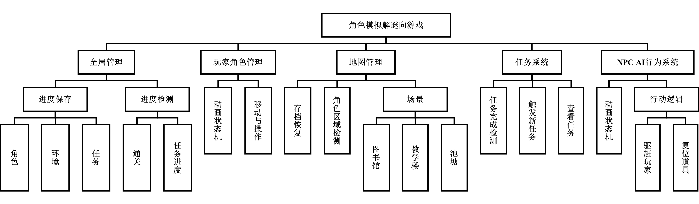
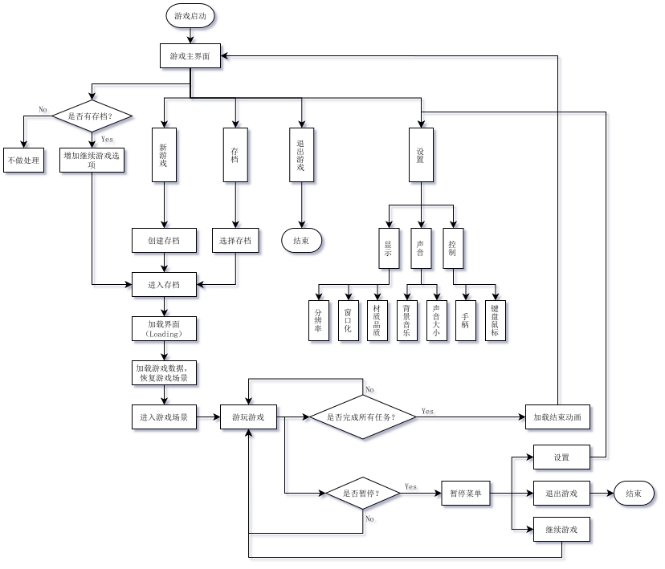  

- [x] text
- [ ] text

### 预期结果
基于Unity 3D引擎设计实现一套可完整运行的第三人称固定视角的模拟角色解谜向游戏，实现游戏的游玩逻辑和具体功能。具体表现在完成三渲二风格的URP渲染管线的设置、完成场景的搭建、实现角色动作交互。制作NPC AI，编写逻辑脚本，完成NPC自动寻路等功能。以及检测是否连接互联网从而进行热更或离线模式的游玩。
在玩法方面，玩家通过鼠标键盘或手柄实现设置等按钮的选择与确定，使用相关功能键实现玩家操控，进入引导关卡。在游玩中通过外设实现对角色的控制。

## 项目细节
### 资源准备
猫咪模型与动作：从Unity Asset Store下载导入 Low Poly Cats 2.2.unitypackage
材质转换：在Package Manager中安装 Universal RP，然后 Window -> Rendering -> Universal Render Pipeline -> Upgrade Project Materials to UniversalRP Materials
场景模型：从Unity Asset Store下载导入 Low Poly Nature Pack 1.0.unitypackage

### 热更新框架搭建
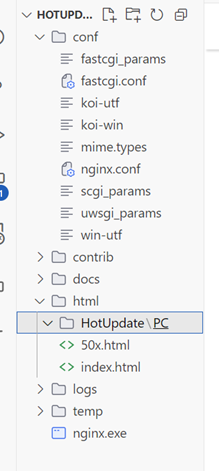  
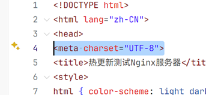  
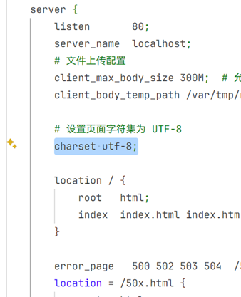  
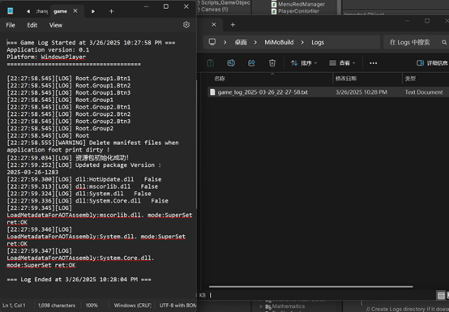  
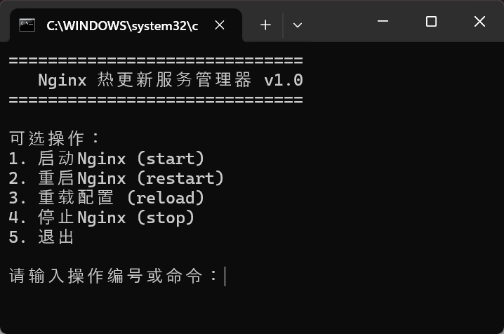  
```bash
@echo off
setlocal enabledelayedexpansion

:: 设置Nginx路径
set NGINX_PATH=D:\CodingProjects\Nginx\hotupdate_nginx_1.27.4
set NGINX_EXE=%NGINX_PATH%\nginx.exe

:menu
cls
echo ==============================
echo    Nginx 热更新服务管理器 v1.0
echo ==============================
echo.
echo 可选操作：
echo 1. 启动Nginx (start)
echo 2. 重启Nginx (restart)
echo 3. 重载配置 (reload)
echo 4. 停止Nginx (stop)
echo 5. 退出
echo.
set /p choice=请输入操作编号或命令：

:: 转换输入为小写便于比较
set "choice=!choice: =!"
set "choice=!choice!"
if /i "!choice!"=="1" set choice=start
if /i "!choice!"=="2" set choice=restart
if /i "!choice!"=="3" set choice=reload
if /i "!choice!"=="4" set choice=stop
if /i "!choice!"=="5" exit

:: 执行对应操作
if /i "!choice!"=="start" (
    echo 正在启动Nginx...
    cd /d "%NGINX_PATH%"
    start "" "%NGINX_EXE%"
    echo Nginx已启动
    pause
    goto menu
) else if /i "!choice!"=="restart" (
    echo 正在重启Nginx...
    taskkill /f /im nginx.exe >nul 2>&1
    cd /d "%NGINX_PATH%"
    start "" "%NGINX_EXE%"
    echo Nginx已重启
    pause
    goto menu
) else if /i "!choice!"=="reload" (
    echo 正在重载Nginx配置...
    cd /d "%NGINX_PATH%"
    nginx -s reload
    echo Nginx配置已重载
    pause
    goto menu
) else if /i "!choice!"=="stop" (
    echo 正在停止Nginx...
    taskkill /f /im nginx.exe >nul 2>&1
    echo Nginx已停止
    pause
    goto menu
) else (
    echo 无效输入，请重新选择！
    pause
    goto menu
)
```
#### 使用了HybridCLR与YooAsset之后的开发流程
1. HybridCLR分析代码，生成热更DLL文件
2. YooAsset将DLL文件和其他新增场景资源文件以及手动指定的文件夹下的文件打包
3. 发布到资源服务器
4. （玩家运行游戏，即可热更）
### 第三人称控制
InputSystem + Cinemachine + 视角变化脚本
#### 操作说明
| 操作        | 按键          | 备注 |
| ----------- | ------------- | ---- |
| 移动        | WASD          | /    |
| 跳跃        | Space         | /    |
| 转动视角    | 鼠标          | /    |
| 加速        | Shift         | /    |
| 远跳        | Shift + Space | /    |
| 攻击/操作键 | 鼠标左键      |
| 防御/放置键 | 鼠标右键      |

#### InputSystem
> 对于旧版输入系统 InputManager 的一层封装，按键与方法的映射通过InputSystem来管理，开发者只用在代码中写好固定的操作逻辑即可，与硬件的交互条件通过Unity Editor来配置，适合多设备适配。

1. 创建Actions配置文件
2. 在Player对象上添加Player Input组件来绑定Action和Unity Invoke事件

#### 第三人称视角的实现
1. 安装Cinemachine的Package
2. 创建 Virtual Camera

### 猫咪角色状态机
#### Random Idle
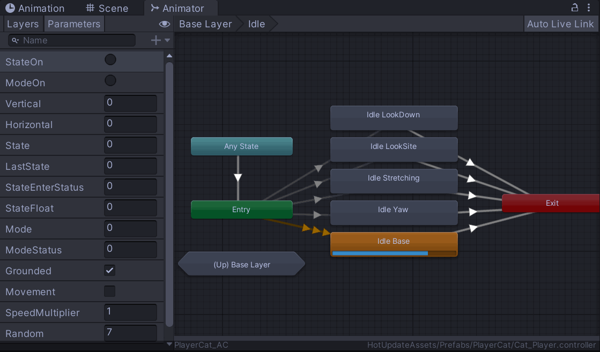  


#### 2D Freeform Cartesian Blend Tree
Unity：左手坐标系

#### Fall 与 根运动
如果动画y轴有偏移，勾选 bake into pose
#### Jump 状态
### 红点系统
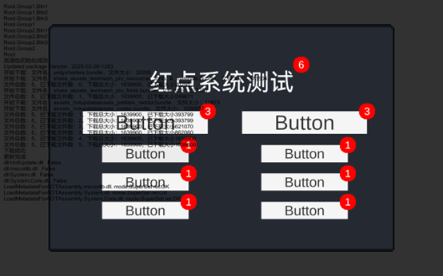  


## 参考链接
- [【在逃猫咪】在水里发现这种猫科动物，千万别吸！](https://www.bilibili.com/video/BV1PYPWeVEgZ/)
- [C#语言](https://www.youtube.com/watch?v=EgIbwCnQ680&list=PLZX6sKChTg8GQxnABqxYGX2zLs4Hfa4Ca)
- [Unity获取盗版插件指北](https://wenjie.store/archives/unity%E8%8E%B7%E5%8F%96assetstore%E7%9B%97%E7%89%88%E6%8F%92%E4%BB%B6%E6%8C%87%E5%8C%97)


### 文献
- [《2024年1-6月中国游戏产业报告》正式发布](https://www.cgigc.com.cn/details.html?id=08dcaca7-6753-4d1e-8938-f61cd1acd37b&tp=report)
- https://www.yooasset.com/docs/Introduce
- https://hybridclr.doc.code-philosophy.com/
- [优雅的UML类图](https://refactoringguru.cn/design-patterns/abstract-factory)
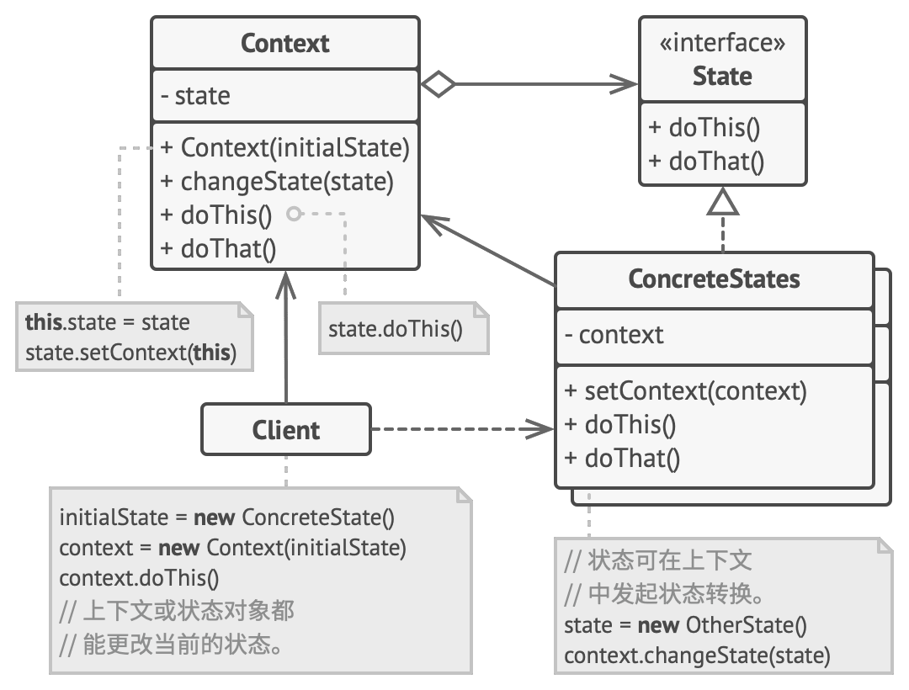  
飞书可以画出类似上述的效果
- 


### 资源/插件
- [Animal Controller](https://malbersanimations.gitbook.io/animal-controller)
  - [AC Tutorial](https://www.youtube.com/watch?v=q5tAmVpqSWA&list=PLh3LIrWD73czEsKkJK78BfLJ83KGKbDik)
  - [Using the new input system with Malbers Animal Controller](https://www.youtube.com/watch?v=TjX3xN7qeZM&list=PLh3LIrWD73cwzPwbVLCXzPhCMaVPNVLK6)
- [Spinal Animator](https://www.youtube.com/watch?v=LUUAkCHIfIU)
  - [How to animate animals from cheap package more realistically](https://www.youtube.com/watch?v=fmp1t5Ug5CI)
- [CSDN讲AC](https://blog.csdn.net/adsdasdasdahj/article/details/142670492)
- Synty Studios模型 Low-Poly材质
- [代码打字练习SpeedCoder](https://www.speedcoder.net/lessons/csharp/1/)
- [更好看的各种打字练习monkeytype](https://monkeytype.com/)
- [GIF转PNG图集](https://tool.koalahollow.com/gifconverter)
- [Newtonsoft JSON Documentation](https://www.newtonsoft.com/json/help/html/Introduction.htm)
- [CodeImgGenerator](https://www.ray.so/)

### 技术
- [还在 Input.GetKey？一次搞懂 Unity 新版输入系统！【Unity 小技巧】](https://www.bilibili.com/video/BV1Pu57z3EKB/)
- [Unity: CHARACTER CONTROLLER vs RIGIDBODY](https://medium.com/ironequal/unity-character-controller-vs-rigidbody-a1e243591483)
- [Rigidbody实现玩家控制](https://medium.com/@tumo.yeh/unity3d一次就搞定角色移動-上-基礎移動-抖動避免-高度控制-菜鳥開發紀錄-1-a64998200119)
- [Unity : 使用 Rider 进行调试，卡在 Reloading Domain](https://blog.csdn.net/weixin_44918974/article/details/142564439)
- [Unity Universal Render Pipeline (URP) - Initial Setup](https://www.tomstephensondeveloper.co.uk/post/unity-universal-render-pipeline-urp-initial-setup)
- [升级自定义 Shader 以兼容 URP](https://docs.unity.cn/cn/Packages-cn/com.unity.render-pipelines.universal@14.1/manual/urp-shaders/birp-urp-custom-shader-upgrade-guide.html)
- [ps动画制作方法视频：添加时间轴操作图层建立逐帧图片](https://www.bilibili.com/video/BV1nb41147r7/) 
- [Unity场景Addictive加载导致的光照问题](https://blog.csdn.net/qq_26318597/article/details/120972465)

## 类图
### 事件系统
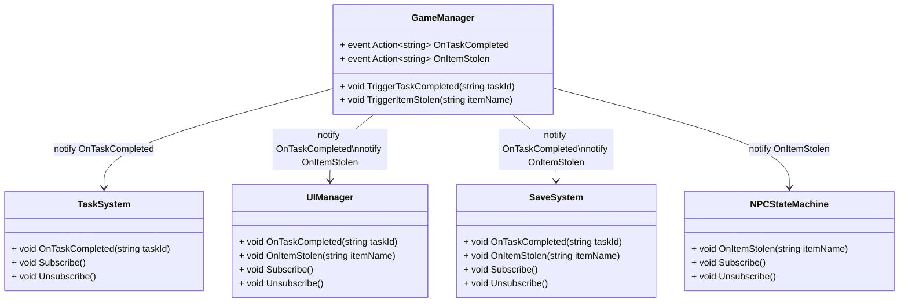

### 存档系统
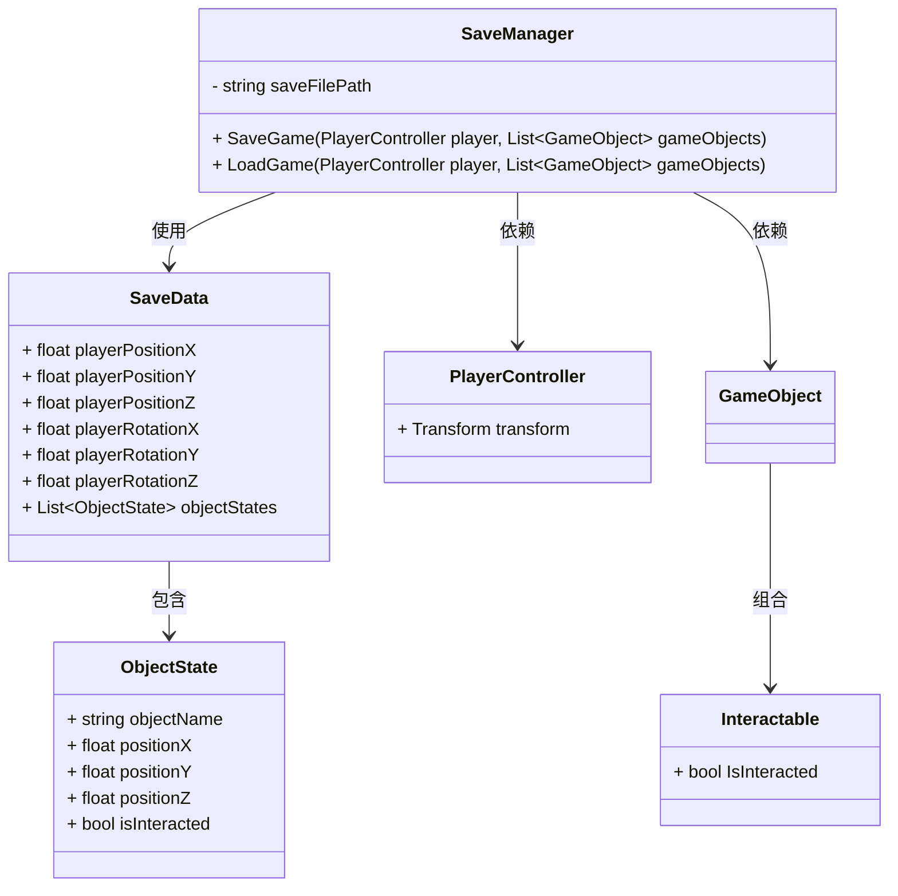

